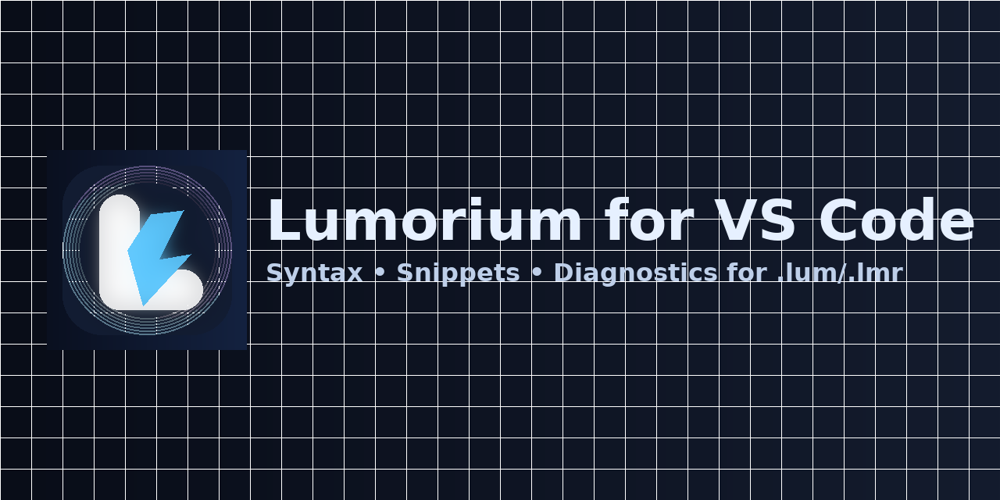

# Lumorium for VS Code

Syntax highlighting, snippets, and diagnostics for `.lum` / `.lmr` scripts (Fluxorium × Lumorium).

## Features
- TextMate grammar for methods, arrows, directives, content types, and numbers.
- Snippets for common rules (REPLY / FILE / EXEC).
- Lightweight diagnostics for malformed lines while you type.

## Features
- TextMate grammar highlighting for methods, paths, arrows, directives, and content types.
- Language configuration: comment toggles, bracket/quote auto-closing.
- Snippets for common rules (REPLY / FILE / EXEC and HTTP verbs).
- Basic diagnostics (regex-based) to catch common mistakes while you type.

## Getting Started
1. Clone this folder: `git clone https://github.com/ianbloc/Lumorium-VSCode.git` (or copy files into a folder).
2. Install deps: `npm i`.
3. Press `F5` in VS Code to launch the Extension Development Host.
4. Open a `.lum` file and start typing.

## Packaging
- Install: `npm i -g @vscode/vsce`

- Build: `npm run package` → produces a `.vsix` you can install via VS Code (Extensions → … → Install from VSIX…).
